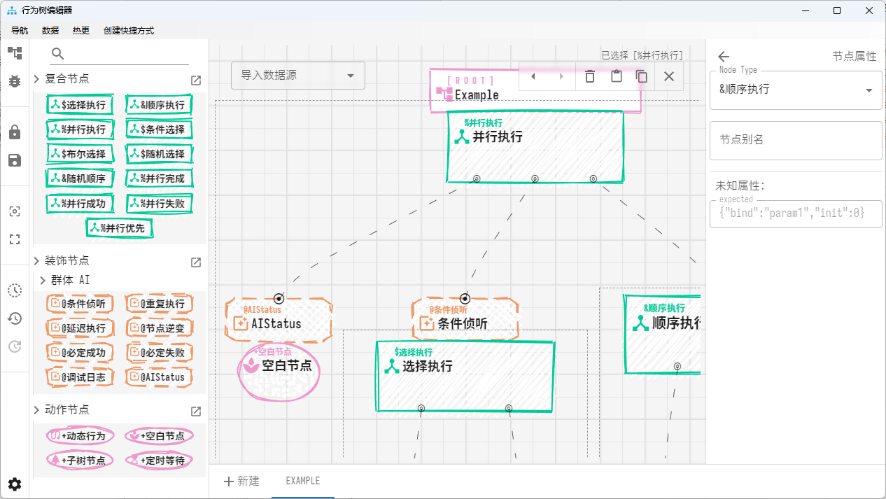
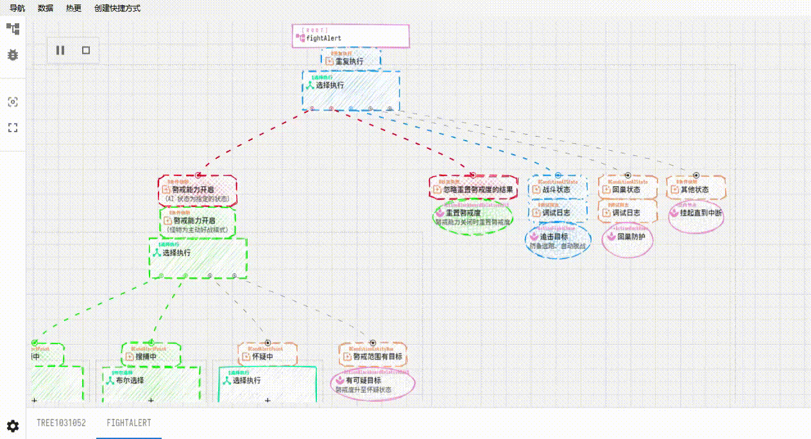

# Behavior Tree Visual

大体设计思路是照着 UE 的事件驱动的行为树设计的，但节点定义比较灵活，理论上也能应用到传统帧驱动的树上。

编辑器主体就是个网页，用 React 开发，然后用 PyWebview 包装了一下。没有嵌入 CEF 或 Chromium，而是直接调用系统 Webview2 内核（EdgeChromium），在较新的 Win10+ 系统上基本是内置的，若没有安装可能需要单独下载安装一下。

## Develop

### VSCode 调试

1. 准备 `pnpm` 和 `NodeJS` 环境，参考：https://pnpm.io/zh/cli/env
2. 在项目路径下打开控制台执行 `pnpm install` 命令以安装依赖。
3. 用 VSCode 打开本项目工作空间（bt-visual.code-workspace）。
4. VSCode 左侧找到运行和调试面板，分别启动 `vite dev` 和 `Launch Edge` 任务。

### 控制台运行

1. 参考上一节 1, 2 步骤准备环境和安装依赖。
2. 控制台执行 `pnpm dev` 命令启动开发服务。

## Usage

[在线预览](https://bt-visual.netlify.app/editor)

编辑器页面：

调试器页面：（在线预览调试器页面，可以在服务地址输入 `/test` 来模拟调试查看效果）

### 操作说明：

基本上常用操作应该还算直观，这里简单说明一下一些特殊操作：

拖拽：从左侧拖拽节点到树上时注意看光标图标变化，一些节点组合的限制从图标上内体现出来，比如装饰节点得往被装饰的目标节点的上半部分拖，以免造成操作歧义。在树上的拖拽需要拖拽锚点，暂不支持直接拖拽节点，这点麻烦大家习惯一下。数上的拖拽默认为移动，按住 Ctrl 则改为复制操作。
编辑器页面选择树文件时按住 Ctrl 可打开新浏览器页签而不是直接跳转，以便对比修改。树编辑页面选择树页签时按住 Ctrl 可只读模式打开锁定编辑的页签以便对比。
鼠标滚轮缩放树结构视图，按住 Shift 再滑动鼠标滚轮调整树结构高度。另外，作为浏览器默认行为，按住 Ctrl 再滑动鼠标滚轮缩放整个编辑器视图。
复制时（快捷键 Ctrl+C）会同时复制一份树结构 JSON 和一份节点截图快照。另外复制时同时按住 Ctrl+Shift+C 会将当前选中的节点作为保存为 svg 文件，可将其作为预设节点拖拽回树中。
节点配置在 .data/bt-visual/behavior-tree-nodes.yaml 文件里，可以参考其他节点来修改。

## TODO List
- [ ] Debug 子树展开折叠问题
- [ ] Debug 时查看黑板值属性
- [ ] Debug 时重启行为树功能
- [ ] 基础文档说明
- [ ] 尝试 Tauri 之类的 Native 端方案
- [ ] 数据源方案优化（现在是在套壳 PyWebview 那层做的）
- [ ] 代码整理优化，现在代码组织的有点乱
- [ ] 支持多工作空间切换
- [ ] 节点列表编辑（现在是直接编辑外部文件）
- [ ] WebSocket 有状态 session 设计过于复杂待简化
